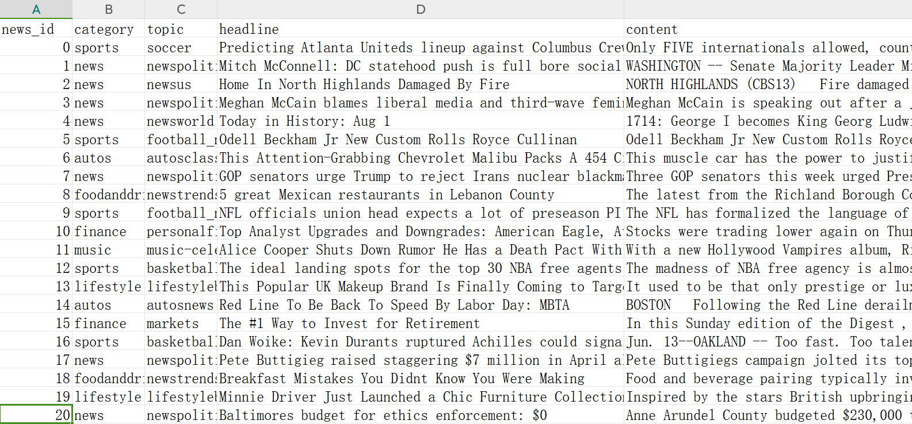
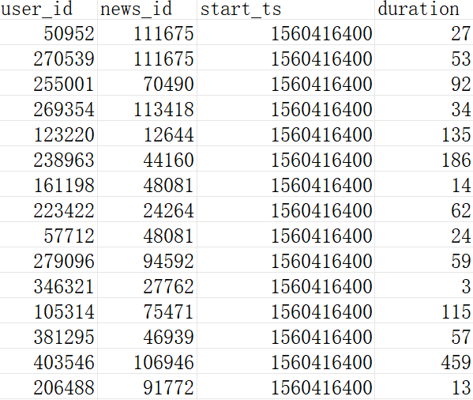

# 新闻动态分析系统
## 0. 项目结构

- data_simulation：用于新闻数据与点击流数据模拟任务
- etl：存放ETL相关的代码和配置
- backend：存放后端存储、查询、分析代码
  - storage：存放存储系统相关的代码和配置
  - analysis：存放分析服务器相关的代码和配置
- frontend：存放用户界面相关的代码和资源

## 1. 项目介绍

在本项目中，实现了一个新闻实时动态变化分析系统，为PENS数据提供新闻话题实时动态变化分析、各类新闻历史/实时统计，新闻话题推荐等功能。具体模块大致如下：

**1）新闻数据和点击流数据模拟**：采用PENS中提供的新闻曝光日志（Impression Log），对新闻曝光日志构建模拟日志产生程序，模拟时序的日志产生。

**2）ETL**: 采用Flume框架，采集上一步骤中模拟产生的新闻曝光日志。数据在经过ETL步骤后，需要放入到Kafka的队列中进行流量控制，然后将其存储到你定义的存储系统中。同时获取PENS中的新闻数据。

**3）Storage System**: 该模块应当完成数据的存储（可使用各类关系型或非关系型存储），并为Query Server提供高性能的查询服务。在存储的过程中，应当考虑数据预处理、数据建模、索引等建立的合理性，以提高效率和系统稳定性，达到系统性能指标。

**4）Analysis Server**: 该模块为前端的数据提供智能查询和分析服务，采用Spark Streaming技术，基于AI+BI的Agent的分析方法。应当为前端需要实现的针对新闻动态的检索和分析能力。

**5）UI**: 该模块为前端的数据可视化。需要开发针对新闻动态变化的查询和分析，并对结果进行合理的可视化，以实现对结果集的快速访问。

## 2. 数据集分析

PENS数据集包含113,762篇新闻，其主题分为15个类别。每个新闻包括新闻ID、标题、正文和由编辑手动标记的类别。新闻标题和正文的平均长度分别为10.5和549.0。数据集覆盖的时间为：**2019年6月13日-2019年7月3日。**数据集具体内容如下：

- `news.tsv` 中包含了新闻文章的信息

| **字段**       | **示例**                                                     | **含义**                                                     |
| -------------- | ------------------------------------------------------------ | ------------------------------------------------------------ |
| Category       | sports                                                       | 新闻所属的15个类别之一                                       |
| Entity content | {'Atlanta United FC': {...}}                                 | 实体的详细信息，包括实体类型、标签、描述、别名、属性和站点链接等 |
| Headline       | Predicting Atlanta United's lineup against Columbus Crew in the U.S. Open Cup | 新闻标题                                                     |
| News body      | Only FIVE internationals allowed, count em, FIVE! So first off we should say, per our usual Atlanta United lineup predictions, this will be wrong... | 新闻正文内容                                                 |
| News ID        | N10000                                                       | 新闻的唯一ID                                                 |
| Title entity   | {"Atlanta United's": 'Atlanta United FC'}                    | 新闻标题中包含的实体，以字典形式表示，包括实体在标题中的文本和对应的Wikidata实体ID |
| Topic          | soccer                                                       | 新闻的具体主题                                               |

- `train.tsv` 是用于训练的用户点击历史记录和展示日志

- `valid.tsv` 是用于验证的用户点击历史记录和展示日志

| **字段**      | **示例**                     | **含义**                                                     |
| ------------- | ---------------------------- | ------------------------------------------------------------ |
| UserID        | U335175                      | 用户的唯一ID，用于标识不同的用户                             |
| ClicknewsID   | N41340 N27570 N83288 ...     | 用户历史点击的新闻ID列表，以空格分隔。该字段用于记录用户的兴趣偏好 |
| dwelltime     | 116 23 59 ...                | 用户历史点击的新闻浏览时长，以空格分隔。该字段可用于评估用户对不同新闻的兴趣程度 |
| exposure_time | 6/19/2019 5:10:01 AM#TAB#... | 历史点击新闻的曝光时间，以“#TAB#”分隔。该字段可用于分析用户对不同时间段新闻的兴趣程度 |
| pos           | N55476 N103556 N52756 ...    | 本次展示日志中用户点击的新闻ID列表，以空格分隔。该字段用于记录用户在本次展示中点击的新闻 |
| neg           | N48119 N92507 N92467 ...     | 本次展示日志中未被用户点击的新闻ID列表，以空格分隔。该字段用于记录用户在本次展示中未点击的新闻 |
| start         | 7/3/2019 6:43:49 AM          | 本次展示日志的开始时间，用于记录用户开始阅读的时间           |
| end           | 7/3/2019 7:06:06 AM          | 本次展示日志的结束时间，用于记录用户结束阅读的时间           |
| dwelltime_pos | 34 83 79 ...                 | 本次展示日志中用户点击新闻的浏览时长，以空格分隔。该字段用于评估用户对本次展示中点击新闻的兴趣程度 |

## 3. 模拟日志产生

### 3.1. 数据集处理

- **对于新闻数据（news.tsv）**

  在 `process_news.py` 中：

  - 删去无用字段Title entity和Entity content
  - 对字段重命名为小写字母

  - 将news_id字段去除前导N，转换为int存储，方便后续在数据库中设置主键和建立索引

  - 针对所有英文字段进行了清洗，去除了换行符、制表符、转义符等无用数据

  最后我们得到了**113762条新闻**，每条新闻包含news_id、category、topic、headline和content字段



- **对于点击记录（train.tsv和valid.tsv）**

  在 `process_tv_1.py` 中，我们将train.tsv和valid.tsv合并，得到50万条记录（该记录每当用户点开新闻页面产生一条），通过分析每条记录的各个字段，可以将他们分成两部分：

  1. 用户历史点击记录，指在当前时刻，用户的历史中所有曾经点击过新闻ID、对应的点击事件和浏览的持续时间

  2. 当前页面点击记录，指只针对当前浏览页面存在的新闻，用户点击和没有点击的新闻ID、点击过新闻的浏览持续时间、以及当前记录的最初始时间

  针对这两个部分，我们发现前者可以精确到每次点击的时间点和该次浏览的持续时间，但后者只能精确到打开该页面的时间点，对于该页面上点击的新闻，只有浏览的持续时间。并且我们发现历史点击记录包含了当前页面点击记录，并且前者总数远远大于后者。因此最后我们使用用户历史点击记录，即字段ClicknewsID、dwelltime和exposure_time。

  在 `process_tv_2.py` 中我们使用`.split`函数将其分割为4元组，即`(user_id`**`, `**`news_id`**`, `**`start_ts`**`, `**`duration)`，分别表示用户ID、新闻ID、新闻点击时间戳、浏览时间，这里我们将诸如`6/19/2019 5:10:01 AM`的字符串转换为时间戳，用`unsigned int`，从而便于排序和查询速度。

  最后保存得到**27186238条点击记录**，我们将其按照start_ts进行排序，并存储在csv文件中。



### 3.2. 日志生成

在 `log_simulation.py` 中我们直接读取上述处理过后的`log.csv` 文件，将其使用`.iterrows()`按行迭代。

我们设置一个当前时间戳，每当新读取一行点击时间，用新时间戳减去当前时间戳得到时差delta，并让程序睡眠delta秒，睡眠完成后再将其写入到`click.log` 文件中。由flume监视其改变，当有新的内容在文件末尾写入时，就将其采集给kafka消息队列中。

## 4. 数据采集
### 4.1 Flume日志采集
- 使用了 Flume 来实时监控 /opt/click.log 文件的新增内容，将其采集并发送至 Kafka。
- 使用 Kafka Sink 将日志消息推送到 Kafka 的 flume-topic 中。
Kafka 在这里是一个 消息中间件，用于缓冲 Flume 发过来的数据，提供给 PySpark 程序进行消费和处理。
- Kafka 是整个系统的消息缓冲和解耦中心。
```
agent1.sources = r1
agent1.channels = c1
agent1.sinks = k1

# source: 监测log文件
agent1.sources.r1.type = TAILDIR
agent1.sources.r1.filegroups = f1
agent1.sources.r1.filegroups.f1 = /opt/click.log
agent1.sources.r1.positionFile = /opt/flume-taildir.position
agent1.sources.r1.batchSize = 100
agent1.sources.r1.deserializer = LINE
agent1.sources.r1.deserializer.maxLineLength = 2000

# channel: 内存channel
agent1.channels.c1.type = memory
agent1.channels.c1.capacity = 10000
agent1.channels.c1.transactionCapacity = 1000

# sink: kafka sink
agent1.sinks.k1.type = org.apache.flume.sink.kafka.KafkaSink
agent1.sinks.k1.topic = flume-topic
agent1.sinks.k1.brokerList = localhost:9092
agent1.sinks.k1.requiredAcks = 1
agent1.sinks.k1.batchSize = 100

# 绑定关系
agent1.sources.r1.channels = c1
agent1.sinks.k1.channel = c1
```
### 4.2 Spark Streaming
用 PySpark 编写了一个流处理应用，使用Spark Streaming。
- 从 Kafka 的 flume-topic 实时读取数据
- 对数据进行 ETL 操作，进行数据清洗、转换、加工
将处理后的结果写入MySQL

## 5. 数据存储设计
### 5.1 t_news

```SQL
create table t_news
(
    news_id               int          not null
        primary key,
    headline              varchar(256) null,
    content               mediumtext   null,
    category              varchar(16)  not null,
    topic                 varchar(64)  not null,
    total_browse_num      int unsigned not null,
    total_browse_duration int unsigned not null,
);
```

该表存储了所有的新闻信息，包含新闻ID、标题headline、内容content、类别category、主题topic，以及用于统计的总浏览次数total_browse_num和总浏览时长total_browse_duration。

### 5.2. t_news_browse_record

```SQL
create table t_news_browse_record
(
    user_id   int          not null,
    news_id   int          not null,
    start_ts  int unsigned not null,
    duration  int          not null,
    start_day int unsigned not null
);

create index t_news_browse_record_news_id_index
    on t_news_browse_record (news_id);

create index t_news_browse_record_start_day_index
    on t_news_browse_record (start_day);

create index t_news_browse_record_start_ts_index
    on t_news_browse_record (start_ts);

create index t_news_browse_record_user_id_index
    on t_news_browse_record (user_id);
```

该表存储用户的新闻浏览记录，包括用户ID、新闻ID、浏览时间戳、浏览持续时间和浏览的天戳，这里的天戳指距离1970年的天数。该表会在kafka队列出口的实时流计算程序中被不断添加新的行。

我们将以秒和天作为最小单位的时间都以整数表示，在具体需要显示时再将其转换，目的是便于建立索引、加快诸如根据天数统计相关信息的速度。

我们针对用户ID、新闻ID、时间戳start_ts、天戳start_day都建立了索引，分别加快了：

1. 用户ID索引：加快针对某些用户浏览情况的查询
2. 新闻ID索引：加快针对某些/某类新闻被点击情况的查询
3. 时间戳start_ts和天戳start_day索引：加快针对某个时间段的用户浏览情况和新闻被点击情况的查询

该表的行数很多，因此若进行综合查询（如先查询某一类别的新闻被点击情况），当涉及到表的join时，速度会变得非常慢；因此我们添加了下列表用于实时存储一些冗余信息。

### 5.3. t_news_daily_category

```SQL
create table t_news_daily_category
(
    day_stamp       int         not null,
    category        varchar(16) not null,
    browse_count    int         null,
    browse_duration int         null,
    constraint t_news_daily_category_pk
        unique (day_stamp, category)
);
```

该表存储某天某类别的新闻被浏览的次数和持续时间。作为冗余表，他可以被t_news_browse_record中被直接计算出来，但是由于t_news_browse_record的行数过多，如果按照类别查询，则会与t_news进行join操作，导致查询时间大量增加。因此我们设置定时任务，在kafka队列出口的实时流计算程序中判断是否进入了新的一天（根据四元组中的时间戳），如果进入新的一天，则统计前一天的新闻类别点击情况，并存入本表格，大大提升查询效率。

我们可以根据不同查询任务设置不同的冗余表，并设置类似定时任务程序来从主表中统计相关数据，进而存储到冗余表中，在查询相关任务时直接针对冗余表进行查询，提升效率。


## 实时推荐功能实现简要说明

添加冗余表 `t_news_current_popularity` 用于存储指定时间及此前十五天内各新闻的浏览量，可以设置定时器任务每天进行更新。为提高全表更新的速度，为 `t_news_browse_record` 建立 `news_id` 与 `start_day` 的索引，每次更新时间大约为 20s。

实时推荐步骤如下：
- 获取用户最近浏览的新闻 ID
- 找出这部分新闻中最常出现的新闻种类
- 查找该种类下最近浏览量增长较快的十条新闻，推荐给用户

当前查找速度较慢，可以新增用户偏好表用于存储用户最近浏览的新闻的 ID，避免每次推荐时查询 `t_news_browse_record` 全表，同时使用 Flume 管理更新该表，以提高系统的实时性。

